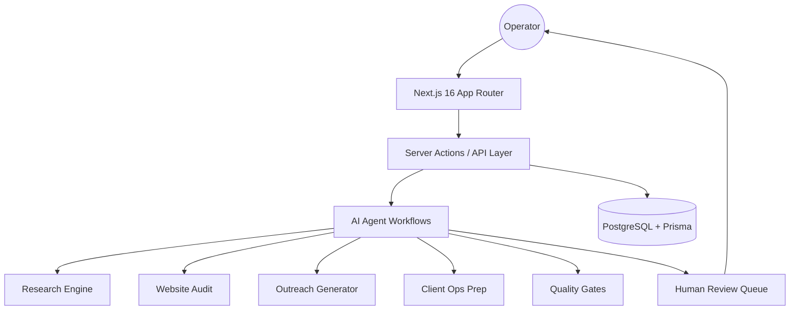

# ⚡ LeadForge AI

> Human-in-the-loop AI RevOps Command Center for lead discovery, deep research, website audits, outreach preparation, approvals, and growth intelligence.

[](https://nextjs.org/)
[](https://react.dev/)
[](https://www.typescriptlang.org/)
[](https://www.prisma.io/)
[](https://www.postgresql.org/)
[](https://github.com/gitleaks/gitleaks)
[](LICENSE)
[](https://leadforge-ai-weld.vercel.app)

---

## 🌐 Live Demo

👉 [https://leadforge-ai-weld.vercel.app](https://leadforge-ai-weld.vercel.app)

---

# 🚀 Why LeadForge AI Exists

Most AI sales tools optimize for one thing:

**Send more messages faster.**

That usually leads to:

* weak personalization
* shallow lead research
* no human review
* unsafe automation
* poor trust with prospects
* zero learning loop

LeadForge AI takes a different approach.

It creates a **real operating system for AI-assisted growth teams** where AI helps with execution, but humans stay in control of decisions.

---

# ✅ Core Workflow

```text
Lead → Research → Website Audit → Outreach Draft → Approval → Client Ops → Outcome Learning
```

This makes growth operations traceable, reviewable, and scalable.

---

# 🧩 Product Modules

## 📋 Pipeline Command Center

Track leads across stages with filters, movement, health view, and operational visibility.

## 🔍 Research Agent

Generate company insights, ICP match signals, pain points, and buying context.

## 🌐 Website Audit Engine

Analyze websites for conversion friction, clarity gaps, trust issues, messaging problems, and growth opportunities.

## ✉️ Outreach Generator

Create personalized:

* cold emails
* LinkedIn messages
* follow-ups
* CTA angles
* offer positioning

## 🛡 Approval Queue

Every outbound action can be reviewed before execution.

## 📈 Growth Mode

Generate a founder-grade 90-day growth strategy from one prompt.

## 🕵️ Competitor Spy

Break down competitor funnels, offers, hooks, CTAs, and positioning strategy.

## 🧪 Roast Lab

Shareable website teardown + landing page rewrite system.

## 📊 Outcome Learning

Track sent, replied, booked, won, and lost signals to improve future workflows.

---

# 🏗 Technical Architecture



---

# ⚙ Tech Stack

| Layer      | Technology              |
| ---------- | ----------------------- |
| Frontend   | Next.js 16 + React 19   |
| Language   | TypeScript              |
| Database   | PostgreSQL              |
| ORM        | Prisma 7                |
| Validation | Zod                     |
| Styling    | Tailwind CSS 4          |
| Security   | Gitleaks + CodeQL       |
| Deploy     | Vercel                  |
| AI Layer   | Structured AI Workflows |

---

# 🚀 Quick Start

## 1. Clone Repository

```bash
git clone https://github.com/karandangi123/leadforge-ai.git
cd leadforge-ai
```

## 2. Install Dependencies

```bash
npm install
```

## 3. Setup Environment

```bash
cp .env.example .env
```

Add:

```env
DATABASE_URL=
OPENAI_API_KEY=
```

---

## 4. Initialize Database

```bash
npm run db:generate
npm run db:migrate
```

---

## 5. Start Development Server

```bash
npm run dev
```

---

# 📁 Project Structure

```text
src/
├── app/            # routes + UI
├── components/     # reusable components
├── actions/        # server actions
├── agents/         # AI workflows
├── lib/            # utilities
├── prompts/        # prompt systems
├── styles/         # UI styling

prisma/             # schema + migrations
docs/               # architecture docs
.github/            # CI/CD + workflows
```

---

# 🛡 Security Principles

* No plaintext secrets committed
* `.env` excluded from Git
* Gitleaks scanning enabled
* CodeQL analysis ready
* Human approvals before side effects
* Structured outputs + validation
* Safe fallback mode when AI keys missing

---

# 📌 Roadmap

## v0.1 Current

* Lead pipeline
* Research workflows
* Website audits
* Outreach drafts
* Approval queue
* Prisma-backed data model

## v0.2 Next

* Gmail draft creation
* CRM sync
* Airtable payloads
* Follow-up reminders
* Multi-user workspace

## v0.3 Future

* Agent analytics
* Eval dashboards
* Learning loops
* Team collaboration
* Advanced automation controls

---

# 🤝 Contributing

We welcome builders, developers, designers, and operators.

## Good First Contributions

* Improve audit scoring logic
* Add eval tests
* Improve mobile UX
* Add integrations
* Improve docs and screenshots
* Accessibility upgrades
* Performance optimization

## Contribution Flow

```text
Fork → Branch → Build → Test → PR
```

---

# ⭐ Why Star This Repo?

If you care about:

* AI agents
* SaaS systems
* Growth automation
* Next.js architecture
* Human-in-the-loop AI
* Real startup products

Give it a ⭐ and follow the journey.

---

# 👨‍💻 Author

**Karan Dangi**
Applied AI Engineer • Builder • Growth Systems
🎓 MANIT / NIT Bhopal

<p align="left">
  <a href="https://github.com/karandangi123"></a>
  <a href="https://www.linkedin.com/in/karan-dangi-4a672925b"></a>
  <a href="https://leadforge-ai-weld.vercel.app"></a>
</p>


---

# 📄 License

MIT License
