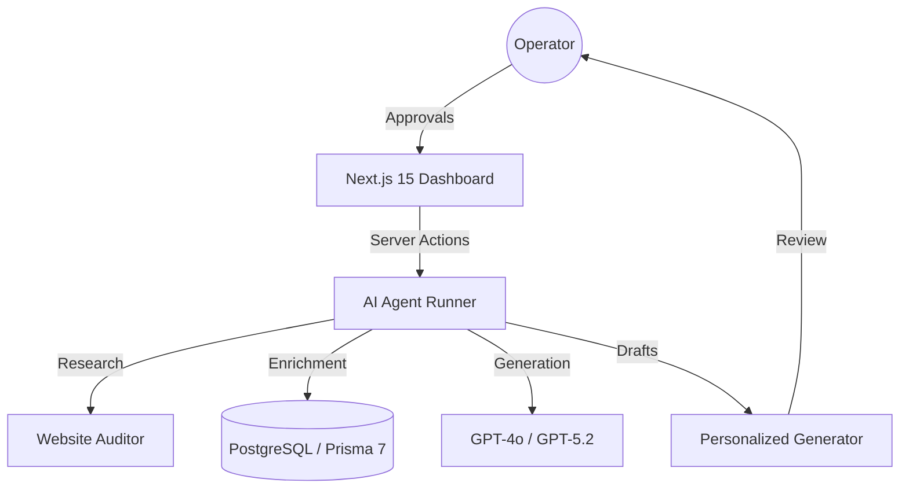

# 🦅 LeadForge AI: The Revenue Operations Agentic Engine

[](https://github.com/karandangi123/leadforge-ai)
[](https://nextjs.org/)
[](https://react.dev/)
[](https://github.com/gitleaks/gitleaks)

**LeadForge AI** is a production-grade AI Revenue Operations (RevOps) engine designed for the 2026 AI era. It orchestrates autonomous agents for lead research, website audits, and personalized outreach—all while maintaining strict **Human-in-the-loop (HITL)** oversight.

---

## ⚡ Core Value Proposition
Most AI lead-gen tools fail because they are "black boxes." **LeadForge AI** solves this with:
- 🛠️ **Agentic Workflows**: Multi-step research and audit agents.
- 🤝 **HITL Approvals**: Human operators review and refine AI outputs before they reach clients.
- 🔍 **Traceability**: Every AI decision is cited and logged for auditability.
- 🧪 **Eval-Driven**: Prompt versioning and evaluation datasets are core to the architecture.

---

## 🏗️ Technical Architecture



---

## 🚀 Quick Start

### 1. Prerequisites
- Node.js 20+
- PostgreSQL (Supabase recommended)

### 2. Installation
```bash
git clone https://github.com/karandangi123/leadforge-ai.git
cd leadforge-ai
npm install
```

### 3. Environment Setup
```bash
cp .env.example .env
# Add your DATABASE_URL and OPENAI_API_KEY
```

### 4. Database Initialization
```bash
npm run db:generate
npm run db:migrate
```

### 5. Launch
```bash
npm run dev
```
Open [http://localhost:3000](http://localhost:3000) to see the agent dashboard.

---

## 🛡️ Security & Reliability
- **Zero-Leak Policy**: Integrated `gitleaks` protection.
- **Deterministic Fallbacks**: Lead actions function via local fallback mode if LLM keys are missing.
- **Type-Safe**: 100% TypeScript with Zod schema validation.

## 🗺️ Roadmap
- [x] **v1.0 (Current)**: Lead dashboard, Research Agent MVP, Prisma Schema.
- [ ] **v2.0**: LangGraph Orchestration, Gmail API integration, Slack Notifications.
- [ ] **v3.0**: CI/CD Eval gates and automated Agent Trace viewer.

---

## 📄 License
Distributed under the MIT License. See `LICENSE` for more information.

<p align="center">
  <b>Built for Scale, Built for Speed.</b><br>
  <i>By Karan Dangi (@karandangi123)</i>
</p>
