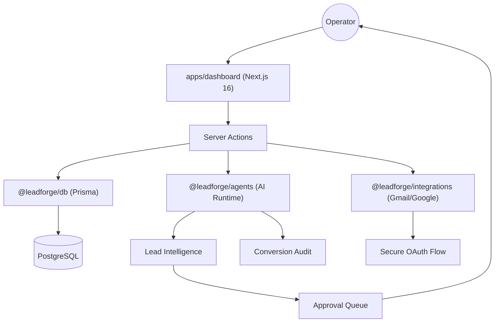

# LeadForge AI

### The Autonomous Revenue Ops Architect

LeadForge AI is an operator-grade, high-fidelity platform designed for revenue and growth teams. It bridges the gap between raw AI potential and production-grade outbound workflows using a **Human-in-the-loop (HITL)** architecture.

[](https://github.com/karandangi123/leadforge-ai/actions/workflows/ci.yml)
[](https://github.com/gitleaks/gitleaks)
[](LICENSE)
[](https://leadforge-ai-weld.vercel.app)

---

## ⚡ The Revenue Engine

LeadForge AI replaces fragmented legacy tools with a single, high-fidelity revenue system. It handles everything from autonomous market discovery to founder-grade outreach drafts.

### Key Capabilities
- **Precision Discovery**: Autonomous market scanning for high-fit industry signals and custom intent.
- **Deep Research**: Automated website audits and competitor intelligence teardowns.
- **HITL Approvals**: A centralized queue where generated work is reviewed before any external action.
- **Gmail Command**: approval-safe draft creation with zero auto-send risk.
- **Growth Lab**: AI-driven 90-day execution strategies and content planning.

---

## 🏗 Architecture

LeadForge follows a clean, monorepo architecture designed for scale and security.



---

## 🛠 Tech Stack

- **Frontend**: Next.js 16 (App Router), React 19, Tailwind CSS 4, Framer Motion
- **Runtime**: Turborepo (Monorepo), Node.js 20+
- **Database**: Prisma 7 + PostgreSQL
- **Security**: Auth.js, Zod, Gitleaks, CodeQL
- **Deployment**: Vercel

---

## 🚀 Quick Start

### 1. Initialize Repository
```bash
git clone https://github.com/karandangi123/leadforge-ai.git
cd leadforge-ai
npm ci
```

### 2. Configure Environment
```bash
cp .env.example .env
# Fill in your DATABASE_URL, OPENAI_API_KEY, and AUTH_SECRET
```

### 3. Setup Database
```bash
npm run db:generate
npm run db:push
```

### 4. Launch Command Center
```bash
npm run dev:all
```

---

## 🛡 Security & Open Core

LeadForge AI is built with an **Open Core** philosophy:
- **Public**: The full UI, AI runtime, and community-driven integrations are open-source under Apache-2.0.
- **Private**: Enterprise billing, premium automation models, and SLA-backed services are isolated via hosted APIs and server-side entitlement checks.

**Security Policy**: Never commit `.env` files. Report vulnerabilities via the flow in [SECURITY.md](SECURITY.md).

---

## 🗺 Roadmap
- [x] High-fidelity dark mode "Command Center"
- [x] Autonomous Hero Revenue Flow
- [ ] Multi-channel sequence automation (LinkedIn/Twitter)
- [ ] Enterprise RBAC and Audit Logging
- [ ] Custom Agentic Tooling SDK

---

## 🤝 Contributing

We welcome senior-grade contributions. Please review [CONTRIBUTING.md](CONTRIBUTING.md) before opening a PR.

## 📄 License

This project is licensed under the **Apache License 2.0** - see the [LICENSE](LICENSE) file for details.

---

**Built with intensity by [Karan Dangi](https://www.linkedin.com/in/karan-dangi-4a672925b)**  
*Applied AI Engineer | Scaling Revenue Engines*
