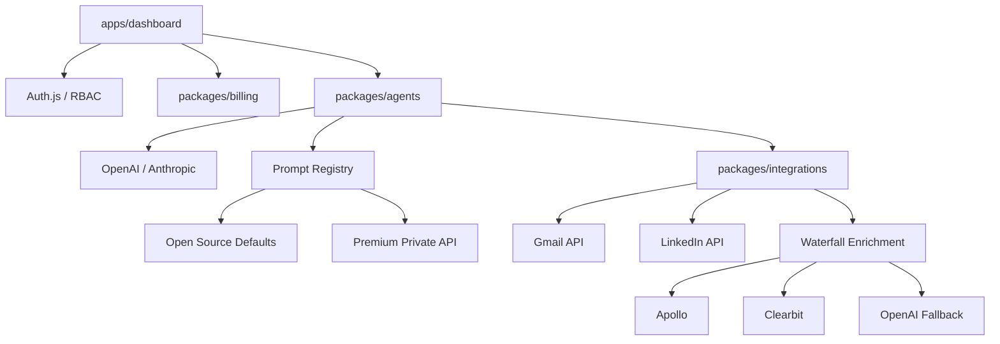

# ⚡️ LeadForge AI: Enterprise-Grade B2B SaaS Platform

[](https://github.com/karandangi123/leadforge-ai/actions/workflows/security.yml)
[](https://opensource.org/licenses/MIT)

**LeadForge AI** is a high-fidelity, production-ready B2B SaaS application designed to automate and orchestrate high-scale, multi-channel outbound growth. Engineered with a strict focus on modularity, data integrity, and enterprise-grade security, it serves as a showcase of advanced full-stack software development and rigorous quality assurance.

Developed, architected, and end-to-end tested by **Karan Dangi** as a solo creator.

---

## 🏗 Modular Architecture & System Design
LeadForge AI is architected as a modular monorepo, enforcing strict package boundaries, clean segregation of business logic, and robust error-handling layers.



### Monorepo Structure
- **`apps/dashboard`**: A high-fidelity Next.js application featuring a modern dashboard layout, real-time revenue analytics, and interactive gating layers.
- **`apps/worker`**: A dedicated background service worker running BullMQ and Redis to execute high-volume async tasks.
- **`packages/agents`**: The core orchestration layer implementing stateful agent execution and structured output schemas.
- **`packages/integrations`**: Robust adapters for external communications (Gmail API, LinkedIn API) and multi-provider data enrichment.
- **`packages/db`**: Consolidated database access schema powered by Prisma ORM and PostgreSQL.
- **`packages/billing`**: Hardened commercial entitlement engine managing feature gates and subscription tiers.

---

## 🧪 Quality Assurance & Test Engineering Framework
A defining feature of the LeadForge AI project is its comprehensive and automated Quality Assurance ecosystem, verifying data validation pipelines, API behavior, and UI stability.

### 1. End-to-End (E2E) Automation (Playwright)
- Implements resilient automated user workflows targeting core surfaces: authentication login bypass loops, workspace creation, interactive components, and page routing.
- Automatically handles background system limits and runs E2E tests against local test databases in deterministic mock states to guarantee consistency.

### 2. CI/CD Quality Gates (GitHub Actions)
- **Static Analysis & Type Checks**: Strict TypeScript type-safety compiler checks and ESLint rules applied globally before allowing merge.
- **Dependency Auditing**: Automated NPM vulnerability scanning (`npm audit`) ensuring dependencies are free of high-level or critical CVEs.
- **Secret Scanning**: Pre-push Gitleaks scan blocks the commit of any active API credentials or private keys.

### 3. Data Integrity & Validation
- Utilizes **Zod** schemas for strong runtime type-checking and API request/response validation.
- Implements database constraint safeguards (such as automated upserts and error catching) to prevent race conditions during concurrent user operations.
- Fault-tolerant background queues via **BullMQ** with built-in retry mechanisms, exponential backoffs, and error fallback handlers.

---

## 🛠 Tech Stack
- **Frontend & Routing**: Next.js (App Router), React, TailwindCSS, TypeScript
- **State & Job Management**: BullMQ, Redis, ioredis
- **Database & Persistence**: PostgreSQL, Prisma ORM
- **Security & Auth**: Auth.js, MFA login flows, Rate Limiting (Upstash Redis)
- **QA Automation**: Playwright, GitHub Actions CI/CD

---

## 🚀 Getting Started

### 1. Prerequisites
- **Node.js** (v20+)
- **Postgres** (Local or Managed instance)
- **Redis** (Local instance or Upstash REST endpoint)

### 2. Installation
```bash
# Clone the repository
git clone https://github.com/karandangi123/leadforge-ai.git
cd leadforge-ai

# Install dependencies
npm install

# Set up environment variables
cp .env.example .env
```

### 3. Database Initialization
```bash
# Generate the Prisma Client
npm run db:generate

# Push schema to database
npm run db:push
```

### 4. Running the Project
```bash
# Run Next.js dashboard and background worker concurrently
npm run dev:all
```

### 5. Running the Test Suite
```bash
# Execute local Playwright E2E smoke tests
npm run test:e2e
```
