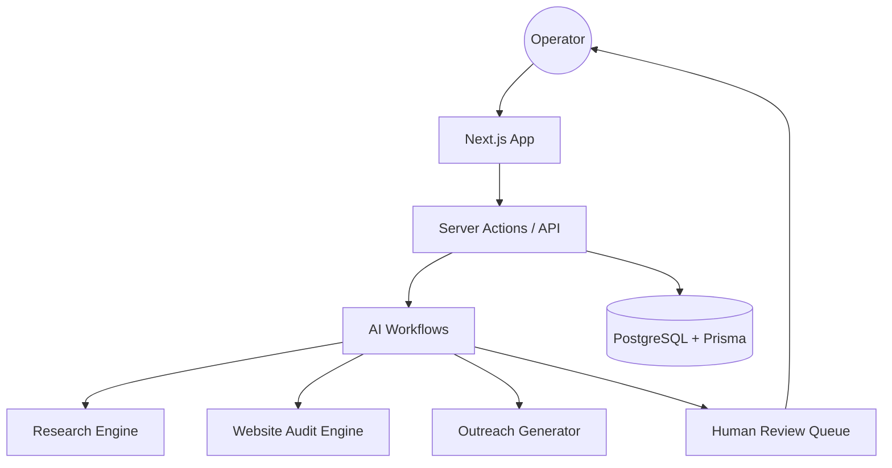

# ⚡ LeadForge AI

> Human-in-the-loop AI RevOps workspace for lead research, website audits, outreach drafting, approvals, and growth experiments.

[](https://nextjs.org/)
[](https://react.dev/)
[](https://www.typescriptlang.org/)
[](https://www.prisma.io/)
[](https://github.com/gitleaks/gitleaks)
[](LICENSE)
[](https://leadforge-ai-weld.vercel.app)

---

## 🌐 Live Demo

👉 [https://leadforge-ai-weld.vercel.app](https://leadforge-ai-weld.vercel.app)

---

## 🚀 What is LeadForge AI?

LeadForge AI is an operator-grade revenue workspace built for modern founders, agencies, and GTM teams.

Instead of jumping from prompt → spam outreach, LeadForge AI creates a **traceable AI workflow** where teams can:

* Discover leads
* Research companies
* Audit websites
* Generate outreach drafts
* Review via approvals
* Track outcomes
* Improve growth strategy

It combines AI speed with human control.

---

## ❌ The Problem

Most AI sales tools focus only on sending more messages.

That creates:

* Low-quality personalization
* No review process
* Weak research
* Risky automation
* No learning loop
* Poor trust with prospects

---

## ✅ The Solution

LeadForge AI introduces a better workflow:

```text
Lead → Research → Audit → Draft → Approval → Send → Learn
```

Every external action can be reviewed before execution.

---

## 🧩 Core Features

### 📋 Pipeline Workspace

Manage leads with stages, filters, health view, and movement across pipeline.

### 🔍 Research Agent

Generate company intelligence, ICP fit signals, and useful context before outreach.

### 🌐 Website Audit Engine

Analyze websites for clarity, conversion friction, trust gaps, and growth opportunities.

### ✉️ Outreach Drafting

Create personalized cold emails, LinkedIn notes, follow-ups, and positioning angles.

### 🛡 Approval Queue

Human review layer before any external action.

### 📈 Growth Mode

Generate one-prompt 90-day growth plans for founders and teams.

### 🕵️ Competitor Spy

Analyze competitor offers, funnels, CTAs, and positioning.

### 🧪 Roast Lab

Shareable website teardown + rewrite suggestions.

---

## 🏗 Architecture



---

## ⚙ Tech Stack

| Layer      | Stack                 |
| ---------- | --------------------- |
| Frontend   | Next.js 16 + React 19 |
| Language   | TypeScript            |
| Database   | PostgreSQL            |
| ORM        | Prisma                |
| Validation | Zod                   |
| Styling    | Tailwind CSS 4        |
| Security   | Gitleaks + CodeQL     |
| Deploy     | Vercel                |

---

## 🚀 Quick Start

### 1. Clone Repo

```bash
git clone https://github.com/karandangi123/leadforge-ai.git
cd leadforge-ai
```

### 2. Install

```bash
npm install
```

### 3. Setup Environment

```bash
cp .env.example .env
```

Add:

```env
DATABASE_URL=
OPENAI_API_KEY=
```

### 4. Database

```bash
npm run db:generate
npm run db:migrate
```

### 5. Run App

```bash
npm run dev
```

---

## 📁 Project Structure

```text
src/
├── app/
├── components/
├── lib/
├── actions/
├── agents/
├── prompts/
├── styles/

prisma/
docs/
.github/
```

---

## 🛡 Security Principles

* No plaintext secrets in repo
* `.env` ignored by Git
* Gitleaks scanning
* CodeQL analysis
* Human approval before side effects
* Structured outputs + validation
* Safe fallbacks when AI keys missing

---

## 🗺 Roadmap

### v0.1

* Lead pipeline
* Research agent
* Website audits
* Outreach drafts
* Approval queue
* Prisma setup

### v0.2

* Gmail drafts
* Airtable sync
* CRM exports
* Reminder flows

### v0.3

* Agent analytics
* Eval dashboards
* Learning loops
* Team collaboration

---

## 🤝 Contributing

We welcome contributions.

### Good First Issues

* Improve audit scoring logic
* Add outreach eval tests
* Improve mobile UX
* Add new CRM adapters
* Improve docs/screenshots
* Accessibility improvements

### Steps

```text
1. Fork repo
2. Create branch
3. Make changes
4. Open PR
```

---

## ⭐ Why Star This Repo?

If you’re interested in:

* AI agents
* RevOps systems
* GTM automation
* Next.js SaaS architecture
* Human-in-the-loop AI
* Real startup systems

Please give it a star ⭐

---

## 👨‍💻 Author

**Karan Dangi**
Applied AI Engineer • Builder • Growth Systems
🎓 MANIT / NIT Bhopal

🔗 LinkedIn: [https://www.linkedin.com/in/karan-dangi-4a672925b](https://www.linkedin.com/in/karan-dangi-4a672925b)

---

## 📄 License

MIT License
