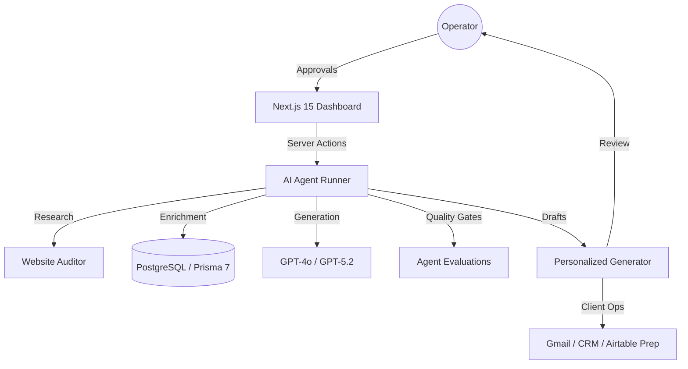

# 🦅 LeadForge AI: The Revenue Operations Agentic Engine

[](https://github.com/karandangi123/leadforge-ai)
[](https://nextjs.org/)
[](https://react.dev/)
[](https://github.com/gitleaks/gitleaks)

**LeadForge AI** is a production-grade AI Revenue Operations (RevOps) engine designed for the 2026 AI era. It orchestrates autonomous agents for lead research, website audits, and personalized outreach—all while maintaining strict **Human-in-the-loop (HITL)** oversight.

---

## ⚡ Core Value Proposition
Most AI lead-gen tools fail because they are "black boxes." **LeadForge AI** solves this with:
- 🛠️ **Agentic Workflows**: Multi-step research and audit agents.
- 🤝 **HITL Approvals**: Human operators review and refine AI outputs before they reach clients.
- 🔍 **Traceability**: Every AI decision is cited and logged for auditability.
- 🧪 **Eval-Driven**: Each agent action can be scored for quality, safety, and readiness before review.

---

## 🏗️ Technical Architecture



---

## 🚀 Quick Start

### 1. Prerequisites
- Node.js 20+
- PostgreSQL (Supabase recommended)

### 2. Installation
```bash
git clone https://github.com/karandangi123/leadforge-ai.git
cd leadforge-ai
npm install
```

### 3. Environment Setup
```bash
cp .env.example .env
# Add your DATABASE_URL and OPENAI_API_KEY
```

### 4. Database Initialization
```bash
npm run db:generate
npm run db:migrate
```

### 5. Launch
```bash
npm run dev
```
Open [http://localhost:3000](http://localhost:3000) to see the agent dashboard.

### First Run
- Use **Start here** to choose between the read-only demo lead and a real database-backed lead.
- Paste a Postgres/Supabase `DATABASE_URL` into the setup assistant.
- Optionally add `OPENAI_API_KEY` for live AI generation.
- The app validates the database, applies the Prisma schema, creates a sample lead, and opens its workspace.
- Fill **Product + ICP setup** so LeadForge knows what you sell, who to target, which pains to solve, proof points, and outreach tone.
- Run **Find leads** with a target market to generate compliant search queries, source boundaries, scored candidate leads, and review-before-save actions.
- Use **Create sample lead** or **Add your first lead** after setup.
- Open the saved lead and run: research, website audit, outreach draft, client ops, approval, and outcome logging.

---

## 🛡️ Security & Reliability
- **Zero-Leak Policy**: Integrated `gitleaks` protection.
- **Deterministic Fallbacks**: Lead actions function via local fallback mode if LLM keys are missing.
- **Product + ICP Playbook**: Workspace-level product, target customer, pains, proof points, industries, and tone guide agent runs.
- **Compliant Lead Discovery**: Target-market discovery generates query plans and scored candidates from safe public-source categories. LinkedIn is manual import only.
- **Quality Gates**: Research, audit, and outreach outputs are scored and stored as evaluations.
- **Client Ops Prep**: Loom scripts, CRM notes, Airtable payloads, and follow-up reminders are generated before external side effects.
- **Approval Controls**: Reviewers can approve or reject prepared work while preserving trace history.
- **Outcome Learning**: Sent, replied, booked, won, and lost outcomes are logged as learning signals.
- **Agent Analytics**: Dashboard summarizes trace coverage, eval pass rate, latency, and learning signals.
- **Type-Safe**: 100% TypeScript with Zod schema validation.

## 🗺️ Roadmap
- [x] **v1.0 (Current)**: Lead dashboard, Research Agent MVP, Prisma schema, playbook, and compliant discovery workflow.
- [ ] **v2.0**: Gmail draft creation, Airtable sync, CRM payloads, follow-up reminders, Loom script generator.
- [ ] **v3.0**: CI/CD eval gates, analytics, outcome learning, and automated Agent Trace viewer.

---

## 📄 License
Distributed under the MIT License. See `LICENSE` for more information.

<p align="center">
  <b>Built for Scale, Built for Speed.</b><br>
  <i>By Karan Dangi (@karandangi123)</i>
</p>

---
### 📫 Connect with Me
[LinkedIn](https://www.linkedin.com/in/karan-dangi-4a672925b)
