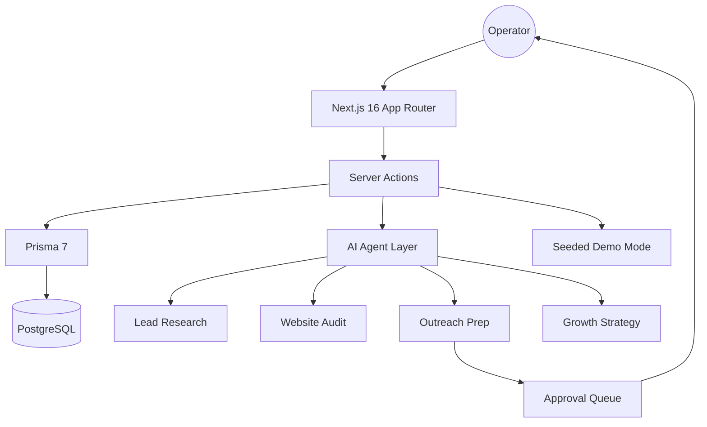

# LeadForge AI

> Human-in-the-loop AI revenue workflow for discovery, research, website audits, approvals, and founder growth planning.

[](https://github.com/karandangi123/leadforge-ai/actions/workflows/codeql.yml)
[](https://github.com/gitleaks/gitleaks)
[](LICENSE)
[](https://leadforge-ai-weld.vercel.app)

[Live demo](https://leadforge-ai-weld.vercel.app) • [Quick start](#quick-start) • [Architecture](#architecture) • [Security](#security) • [Roadmap](#roadmap)

## What LeadForge AI is

LeadForge AI is an operator-grade workspace for revenue and growth teams.

It combines:

- ICP and offer setup
- compliant lead discovery
- lead research and website audits
- human-reviewed outreach preparation
- approval queue operations
- founder-facing growth strategy tools

The product is built to feel like a real workflow, not a one-shot prompt demo.

## What you can do right now

### Core workspace

- Build a product and ICP playbook
- Save leads manually or by CSV import
- Move leads through a real pipeline
- Open a lead workspace with timeline, research, audits, approvals, and outcomes
- Review prepared work from a centralized approvals queue

### Growth surfaces

- Roast a website
- Run competitor positioning analysis
- Generate a one-prompt growth brief

## Why it is different

- **Human-in-the-loop by default**: generated work is prepared for review before external actions.
- **Compliant discovery stance**: manual import or public-source workflows, not gray-area scraping claims.
- **Product-plus-growth shape**: internal RevOps workflow and public-facing growth tools live in one system.
- **Demo-ready without faking maturity**: seeded mode works when infra is unavailable, while Prisma-backed mode supports real data.

## Product surfaces

| Surface | Purpose |
| --- | --- |
| `Pipeline` | Lead board, stage movement, filters, intake, and health view |
| `Discovery` | Compliant lead discovery and candidate review |
| `Playbook` | Product, ICP, pain points, proof, and tone setup |
| `Approvals` | Centralized review queue for prepared work |
| `Roast Lab` | Shareable website audit and rewrite experience |
| `Competitor Spy` | Offer, CTA, and funnel positioning analysis |
| `Growth Mode` | 90-day growth strategy brief from one prompt |

## Architecture



## Stack

- **Frontend**: Next.js 16, React 19, Tailwind CSS 4
- **Backend patterns**: App Router + Server Actions
- **Data**: Prisma 7 + PostgreSQL
- **Validation**: Zod
- **Deployment**: Vercel
- **Security posture**: Gitleaks + CodeQL + protected env handling

## Quick start

### Prerequisites

- Node.js 20+
- PostgreSQL or Supabase for database-backed mode

### Install

```bash
git clone https://github.com/karandangi123/leadforge-ai.git
cd leadforge-ai
npm install
```

### Environment

```bash
cp .env.example .env
# Set DATABASE_URL
# Optionally set OPENAI_API_KEY
```

Local-only guidance:

- Keep `.env` on your machine.
- Do not commit secrets.
- Hosted deployments should use Vercel environment variables.
- `.vercelignore` excludes local `.env` files from Vercel CLI uploads.

### Database

```bash
npm run db:generate
npm run db:migrate
```

### Run

```bash
npm run dev
```

Open [http://localhost:3000](http://localhost:3000).

## First-run flow

1. Open the app in demo mode or connect a database.
2. Fill the Product + ICP playbook.
3. Add or import leads.
4. Run research and audit passes.
5. Generate drafts or client ops prep.
6. Review work in the approvals queue.
7. Track outcomes and refine the workflow.

## Security

- Gitleaks-backed secret scanning in the workflow
- CodeQL for static analysis
- `.env` ignored in Git and excluded from Vercel CLI uploads
- Human approval boundary before outbound or integration-style actions
- No fake claims of automated LinkedIn sending or unsafe scraping workflows

See [SECURITY.md](SECURITY.md) for reporting guidance.

## Repository standards

This repository is being shaped as a production-grade public project:

- clear README and quick start
- contributing guide
- security policy
- issue templates
- PR template
- conventional commits
- Vercel deployment

## Roadmap

- [x] Pipeline board and lead workspace
- [x] Approval queue
- [x] CSV import with duplicate handling
- [x] Roast Lab
- [x] Competitor Spy
- [x] One Prompt Growth Mode
- [ ] Founder Content Engine
- [ ] Proposal generator
- [ ] CRM and provider adapters behind approval
- [ ] richer evaluations and trace analytics

## Contributing

Open an issue for bugs, ideas, or workflow feedback. Small, focused PRs are preferred. See [CONTRIBUTING.md](CONTRIBUTING.md).

## License

MIT. See [LICENSE](LICENSE).

## Built by

**Karan Dangi**  
Applied AI engineer focused on agentic systems, growth workflows, and founder-grade product execution.

[LinkedIn](https://www.linkedin.com/in/karan-dangi-4a672925b)
