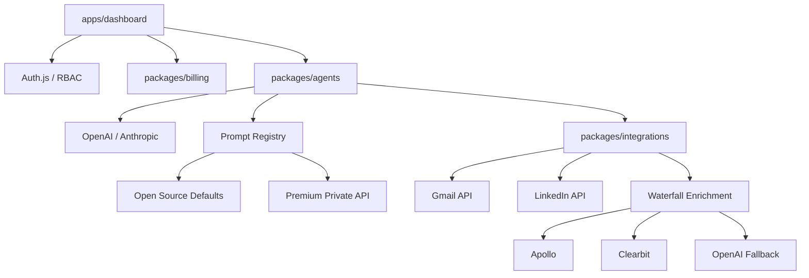
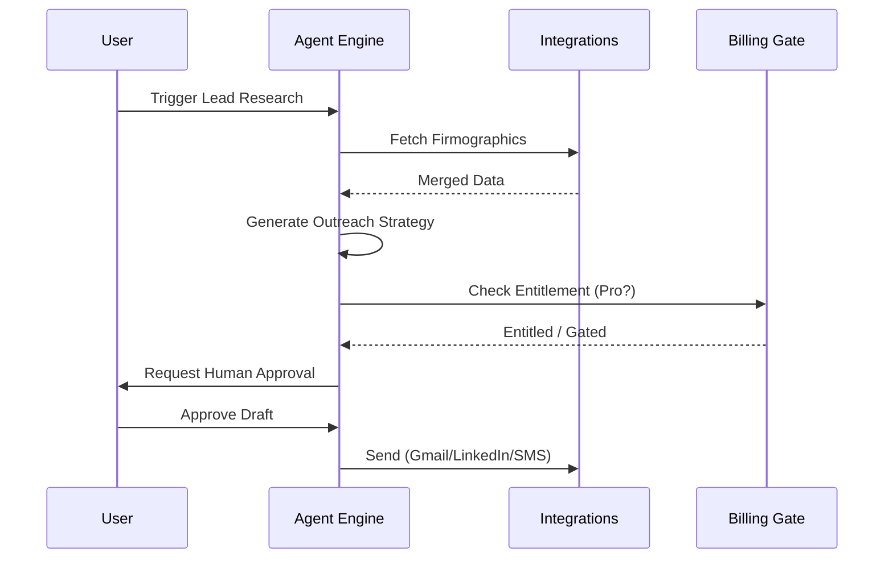

# ⚡️ LeadForge AI: The Autonomous RevOps Engine

[](https://github.com/karandangi123/leadforge-ai/actions/workflows/security.yml)
[](https://opensource.org/licenses/MIT)

**LeadForge AI** is an investor-grade, open-core platform designed to automate high-scale, multi-channel outbound growth. Built with a focus on security, scalability, and agentic intelligence, it empowers RevOps teams to build autonomous sales pipelines that research, audit, and engage leads with founder-level precision.

## 🏗 Modular Architecture
LeadForge AI is architected as a modular monorepo, enforcing strict boundaries between the open-source core and proprietary SaaS capabilities.



## 🤖 Autonomous Workflow


- **`apps/dashboard`**: A high-fidelity Next.js application with cinematic UI gating and real-time revenue intelligence.
- **`packages/agents`**: The orchestration layer for autonomous workflows (Research, Audit, Outreach).
- **`packages/integrations`**: Robust adapters for Gmail, LinkedIn, Twilio, and a waterfall enrichment engine (Clearbit, Apollo, etc.).
- **`packages/billing`**: Hardened commercial layer with Stripe integration and Pro-tier entitlement management.

## ✨ Key Features
- **Autonomous Research**: AI agents that perform deep-dive firmographic and technographic analysis on every lead.
- **Multi-Channel Command Center**: Unified sequencing across Email, LinkedIn, and SMS with human-in-the-loop approval gates.
- **Cinematic Gating**: A "Smarter" UI that distinguishes between free core features and premium Pro/Agency capabilities.
- **Enterprise-Grade Security**: Automated secret scanning (Gitleaks), RBAC foundations, and a zero-trust approach to generated artifacts.

## 🚀 Getting Started

### 1. Prerequisites
- **Node.js** (v18+)
- **Postgres** (Local or Managed)
- **OpenAI API Key**

### 2. Installation
```bash
# Clone the repository
git clone https://github.com/karandangi123/leadforge-ai.git
cd leadforge-ai

# Install dependencies
npm install

# Set up environment
cp .env.example .env
# Fill in your OPENAI_API_KEY and DATABASE_URL
```

### 3. Database Initialization
```bash
npx prisma migrate dev
npx prisma generate
```

### 4. Launch
```bash
npm run dev
```

## 🔐 Open-Core & Commercial Boundaries
LeadForge AI follows a strategic **Open-Core** model. The core orchestration, adapters, and UI are open-source. Proprietary SaaS logic (Premium Prompts, Advanced Deliverability, and Commercial Billing) is isolated via environmental gates:

- **Core Mode**: Enabled by default for community users.
- **Pro Mode**: Enabled via `LEADFORGE_PRO_MODE=true`, unlocking high-performance logic and encrypted prompt registries.

## 🤝 Contributing
We welcome contributions that improve the core engine while respecting the platform's security boundaries. Please review our [CONTRIBUTING.md](./CONTRIBUTING.md) and [SECURITY.md](./SECURITY.md) before submitting a PR.

---

## 🗺 Pro Feature Roadmap
We are rapidly scaling the platform's capabilities. Below is our current roadmap for Pro and Agency tiers:

| Phase | Feature | Tier | Status |
| :--- | :--- | :--- | :--- |
| **Q2** | **Multi-Channel Sequence Engine** | Pro | ✅ Alpha |
| **Q2** | **Native Deliverability Warmup** | Pro | 🛠 Development |
| **Q3** | **White-Label Client Reporting** | Agency | 📅 Planned |
| **Q3** | **Two-Way CRM Sync (HubSpot/SFDC)** | Pro | 📅 Planned |
| **Q4** | **Custom Agentic Skill Builder** | Agency | 📅 Planned |

*Built for the next generation of RevOps consultancies and scaling SaaS teams.*
