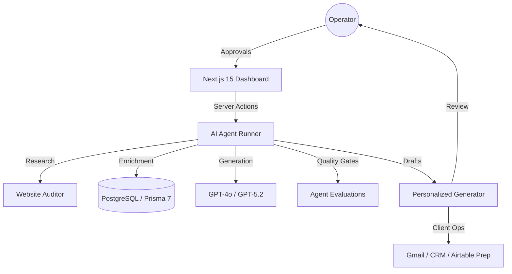

# ⚡️ LeadForge AI: Autonomous RevOps Architect
> **Enterprise-grade AI Command Center for high-scale revenue operations. Modular, traceable, and architected for growth.**

[](https://github.com/gitleaks/gitleaks)
[](https://nextjs.org/)
[](#architecture)
[](https://leadforge-ai-weld.vercel.app)
[](LICENSE)

---

### 🌐 [Click here to visit the Live Command Center](https://leadforge-ai-weld.vercel.app)

---

LeadForge AI is not just another lead scraper. It is a **Production-Grade Command Center** designed to orchestrate autonomous research agents, perform deep website audits, and generate human-in-the-loop outreach strategies at scale.

---

## 🏗️ New: The Modular Command Center
We have recently overhauled the entire UI/UX to follow a **View-Switcher Architecture**, providing a focused workspace for every stage of the RevOps lifecycle:

- **🕹️ Operations Hub**: Central command for monitoring agent performance and real-time ROI.
- **🧠 Intelligence Playbook**: Define your ICP and train agents with deep product context.
- **🕵️ Autonomous Discovery**: Let agents hunt for high-intent leads across the web.
- **📋 Lead Pipeline**: A high-fidelity data grid for inspecting research and approving actions.
- **🛡️ Security & Evals**: Built-in safeguards to ensure agent alignment and quality.

---

## 🛠️ Tech Stack & Engineering
- **Framework**: Next.js 15 (App Router) + TypeScript.
- **Architecture**: Modular "View-Switcher" SPA Logic.
- **Database**: Prisma + Postgres/Supabase for traceable lead persistence.
- **Styling**: Glassmorphic UI with Vanilla CSS & Framer Motion.
- **Security**: Mandatory Gitleaks secret scanning and CodeQL static analysis.

---

## 🏗️ Technical Architecture



---

## 🚀 Quick Start

### 1. Prerequisites
- Node.js 20+
- PostgreSQL (Supabase recommended)

### 2. Installation
```bash
git clone https://github.com/karandangi123/leadforge-ai.git
cd leadforge-ai
npm install
```

### 3. Environment Setup
```bash
cp .env.example .env
# Add your DATABASE_URL and OPENAI_API_KEY
```

### 4. Database Initialization
```bash
npm run db:generate
npm run db:migrate
```

### 5. Launch
```bash
npm run dev
```
Open [http://localhost:3000](http://localhost:3000) to see the agent dashboard.

### First Run
- Use **Start here** to choose between the read-only demo lead and a real database-backed lead.
- Paste a Postgres/Supabase `DATABASE_URL` into the setup assistant.
- Optionally add `OPENAI_API_KEY` for live AI generation.
- The app validates the database, applies the Prisma schema, creates a sample lead, and opens its workspace.
- Fill **Product + ICP setup** so LeadForge knows what you sell, who to target, which pains to solve, proof points, and outreach tone.
- Run **Find leads** with a target market to generate compliant search queries, source boundaries, scored candidate leads, and review-before-save actions.
- Use **Create sample lead** or **Add your first lead** after setup.
- Open the saved lead and run: research, website audit, outreach draft, client ops, approval, and outcome logging.

---

## 🛡️ Security & Reliability
- **Zero-Leak Policy**: Integrated `gitleaks` protection.
- **Deterministic Fallbacks**: Lead actions function via local fallback mode if LLM keys are missing.
- **Product + ICP Playbook**: Workspace-level product, target customer, pains, proof points, industries, and tone guide agent runs.
- **Compliant Lead Discovery**: Target-market discovery generates query plans and scored candidates from safe public-source categories. LinkedIn is manual import only.
- **Quality Gates**: Research, audit, and outreach outputs are scored and stored as evaluations.
- **Client Ops Prep**: Loom scripts, CRM notes, Airtable payloads, and follow-up reminders are generated before external side effects.
- **Approval Controls**: Reviewers can approve or reject prepared work while preserving trace history.
- **Outcome Learning**: Sent, replied, booked, won, and lost outcomes are logged as learning signals.
- **Agent Analytics**: Dashboard summarizes trace coverage, eval pass rate, latency, and learning signals.
- **Type-Safe**: 100% TypeScript with Zod schema validation.

## 🗺️ Roadmap
- [x] **v1.0 (Current)**: Lead dashboard, Research Agent MVP, Prisma schema, playbook, and compliant discovery workflow.
- [ ] **v2.0**: Gmail draft creation, Airtable sync, CRM payloads, follow-up reminders, Loom script generator.
- [ ] **v3.0**: CI/CD eval gates, analytics, outcome learning, and automated Agent Trace viewer.

---

## 📄 License
Distributed under the MIT License. See `LICENSE` for more information.

<p align="center">
  <b>Built for Scale, Built for Speed.</b><br>
  <i>By Karan Dangi (@karandangi123)</i>
</p>

---
### 📫 Connect with Me
[LinkedIn](https://www.linkedin.com/in/karan-dangi-4a672925b)
