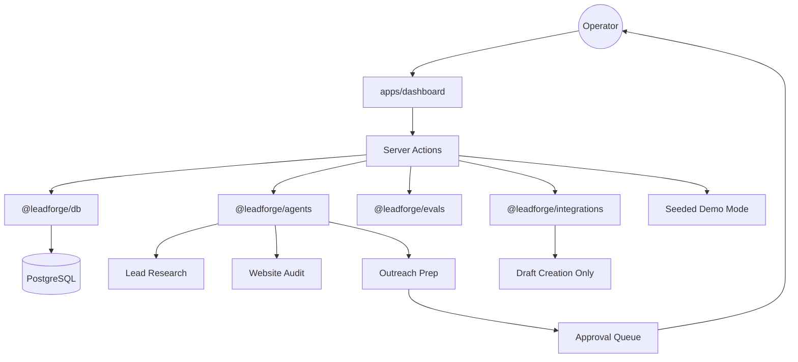

# LeadForge AI

> Human-in-the-loop revenue workflow with one shipped app, real workspace packages, and approval-safe external actions.

[](https://github.com/karandangi123/leadforge-ai/actions/workflows/codeql.yml)
[](https://github.com/gitleaks/gitleaks)
[](LICENSE)
[](https://leadforge-ai-weld.vercel.app)

[Live demo](https://leadforge-ai-weld.vercel.app) • [Quick start](#quick-start) • [Monorepo](#monorepo) • [Architecture](#architecture) • [Security](#security)

## What LeadForge AI is

LeadForge AI is an operator-grade workspace for revenue and growth teams. The current repository is intentionally scoped around one production-facing app, `apps/dashboard`, plus the workspace packages that support it.

It combines:

- ICP and offer setup
- compliant lead discovery
- lead research and website audits
- human-reviewed outreach preparation
- approval queue operations
- founder-facing growth strategy tools

The product is built to feel like a real workflow, not a one-shot prompt demo.

## What you can do right now

- Build a product and ICP playbook
- Save leads manually or by CSV import
- Move leads through a pipeline with approvals and trace visibility
- Run website roasts, competitor analysis, and growth planning flows
- Prepare outreach for approval-safe Gmail draft creation

## Why it is different

- **Human-in-the-loop by default**: generated work is prepared for review before external actions.
- **Compliant discovery stance**: manual import or public-source workflows, not gray-area scraping claims.
- **Product-plus-growth shape**: internal RevOps workflow and public-facing growth tools live in one system.
- **Demo-ready without faking maturity**: seeded mode works when infra is unavailable, while Prisma-backed mode supports real data.

## Product surfaces

| Surface | Purpose |
| --- | --- |
| `Pipeline` | Lead board, stage movement, filters, intake, and health view |
| `Discovery` | Compliant lead discovery and candidate review |
| `Playbook` | Product, ICP, pain points, proof, and tone setup |
| `Approvals` | Centralized review queue for prepared work |
| `Roast Lab` | Shareable website audit and rewrite experience |
| `Competitor Spy` | Offer, CTA, and funnel positioning analysis |
| `Growth Mode` | 90-day growth strategy brief from one prompt |

## Monorepo

```text
apps/
  dashboard/        Next.js 16 App Router UI and server actions
packages/
  agents/           AI runtime and structured outputs
  db/               Prisma schema, generated client, DB helpers
  evals/            Agent scoring and quality checks
  integrations/     External adapters such as Gmail draft creation
```

Shared runtime logic lives in packages. Dashboard-specific presentation and workflow state stay in `apps/dashboard`.

## Architecture



## Stack

- **Frontend**: Next.js 16, React 19, Tailwind CSS 4
- **Backend patterns**: App Router + Server Actions
- **Data**: Prisma 7 + PostgreSQL
- **Validation**: Zod
- **Deployment**: Vercel
- **Security posture**: Gitleaks + CodeQL + protected env handling

## Quick start

### Prerequisites

- Node.js 20+
- PostgreSQL or Supabase for database-backed mode

### Install

```bash
git clone https://github.com/karandangi123/leadforge-ai.git
cd leadforge-ai
npm ci
```

### Environment

```bash
cp .env.example .env
# Set DATABASE_URL
# Optionally set OPENAI_API_KEY
```

Local-only guidance:

- Keep `.env` on your machine.
- Do not commit secrets.
- Hosted deployments should use Vercel environment variables.
- `.vercelignore` excludes local `.env` files from Vercel CLI uploads.

### Database

```bash
npm run db:generate
npm run db:push
```

### Run

```bash
npm run dev --workspace apps/dashboard
```

Open [http://localhost:3000](http://localhost:3000).

### Quality checks

```bash
npm run typecheck
npm run lint:all
npm run build:all
npm run test:e2e
```

## First-run flow

1. Open the dashboard in demo mode or connect a database.
2. Fill the Product + ICP playbook.
3. Add or import leads.
4. Run research and audit passes.
5. Generate drafts or client ops prep.
6. Review work in the approvals queue.
7. Create a Gmail draft only after approval.
8. Track outcomes and refine the workflow.

## Security

- Gitleaks-backed secret scanning in the workflow
- CodeQL for static analysis
- `.env` ignored in Git and excluded from Vercel CLI uploads
- Human approval boundary before outbound or integration-style actions
- Gmail support is draft creation only in this phase; there is no auto-send path
- No fake claims of automated LinkedIn sending or unsafe scraping workflows

See [SECURITY.md](SECURITY.md) for reporting guidance.

## Current priorities

- Fresh clone to green workspace checks
- Honest package boundaries across `apps/dashboard` and `packages/*`
- Approval-safe Gmail draft creation as the first real external workflow
- Clear demo mode behavior when `DATABASE_URL` or `OPENAI_API_KEY` is missing

## Contributing

Open an issue for bugs, ideas, or workflow feedback. Small, focused PRs are preferred. See [CONTRIBUTING.md](CONTRIBUTING.md).

## License

MIT. See [LICENSE](LICENSE).

## Built by

**Karan Dangi**  
Applied AI engineer focused on agentic systems, growth workflows, and founder-grade product execution.

[LinkedIn](https://www.linkedin.com/in/karan-dangi-4a672925b)
